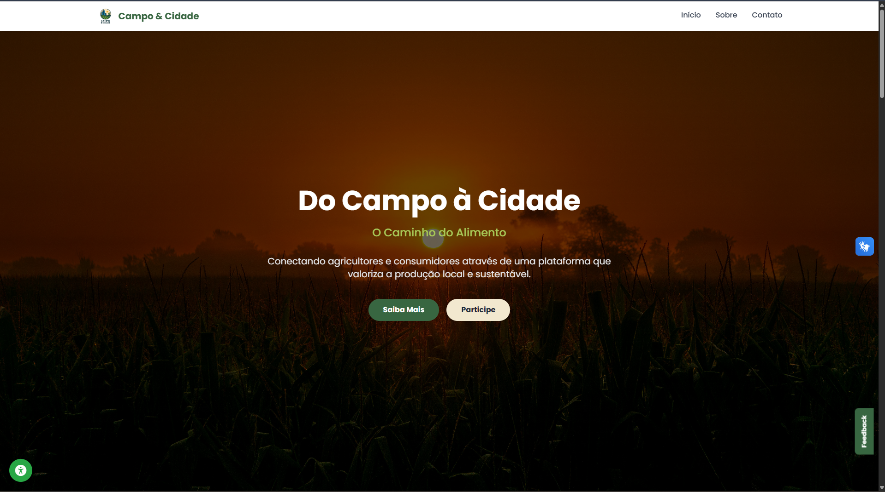

# Projeto Agrinho 2025 - **"Festejando Conexão Campo e Cidade"** 

## 🌐 Ver / Como Rodar o Projeto

* **No seu navegador (online):**
    * [No GitHub Pages](https://alphaxpg.github.io/Isaac-projeto-finalizado/)
    * [No Vercel](https://isaac-projeto-finalizado.vercel.app/)
* **No seu computador:** 📂 É super fácil! Basta baixar este repositório em seu computador, extrarir os arquivos e abrir o arquivo `index.html`, necessário acesso a internet, devido a eu usar frameworks e bibliotecas online.
Projeto Agrinho 2025 - Programação
    * Aconselho fazer aberturua do projeto pelo Vercel, ou fazer download em sua maquina extrarir e abrir.
    * O github Pages mesmo depois de horas feito upload do projeto e ativado, continuava com algumas funções sem carregar o projeto por completo.
    * O githubpages apresenta problemas frequentes de deploy, não sei como estará no momento da avaliação.
    * Reforço novamente a recomendaçãoabrir o projeto pelo deploy do vercel ou download em sua maquina.

🎯 Tema

Festejando a conexão campo-cidade 

📌 Subcategoria

Subcategoria 4: Programação Front-End: HTML e CSS

Este projeto está alinhado à subcategoria direcionada aos estudantes da 2ª e 3ª série do Ensino Médio matriculados no Itinerário Formativo de Matemática e Ciências da Natureza, cursando a unidade curricular de Matemática II (Trilhas de Programação I e II). 

👨‍💻 Estudante

Nome completo: Isaac Habel Lauz Aires

Série/Ano: 3º

Escola: Colégio Estadual Professor Amálio Pinheiro

Município: Ponta Grossa

NRE: Núcleo Regional de Educação de Ponta Grossa

👨‍🏫 Professor Orientador

Nome completo: Felipe Caruso

E-mail institucional: Felipe.caruso@escola.pr.gov.br

🧠 Objetivo do Projeto

O objetivo deste projeto é desenvolver um site interativo para fortalecer a conexão entre os produtores rurais de Ponta Grossa e a comunidade urbana. A plataforma busca resolver a dificuldade que muitos consumidores da cidade têm em encontrar e comprar produtos frescos e locais, ao mesmo tempo que oferece aos agricultores uma vitrine digital para divulgar seu trabalho, seus produtos e promover eventos, como feiras e dias de campo. O site "Conexão Agro Ponta Grossa" foi criado para ser um ponto de encontro virtual, celebrando a riqueza da agricultura local e incentivando o consumo consciente e a valorização do homem do campo.

💡 Descrição Geral

Este projeto consiste em um site informativo desenvolvido inteiramente com HTML e CSS, focado na usabilidade e na apresentação clara das informações.  Ele possui as seguintes seções:

Página Inicial: Uma apresentação visual sobre a importância da conexão campo-cidade, com destaques para produtores e produtos da estação.
Feiras da Cidade: Um calendário semanal com os locais e horários de todas as feiras de produtores em Ponta Grossa, facilitando o acesso da população a alimentos frescos.
Conheça o Produtor: Uma área com perfis de agricultores locais, contando suas histórias, os tipos de produtos que cultivam e suas práticas agrícolas.
Receitas do Campo: Um espaço com receitas que utilizam produtos locais, incentivando a criatividade na cozinha e o aproveitamento dos alimentos.
O design do site foi pensado para ser limpo e responsivo, adaptando-se a diferentes tamanhos de tela, como celulares e computadores.

⚙️ Tecnologias Utilizadas

[x] HTML/CSS 
[ ] JavaScript com p5.js

Observação: Para a Subcategoria 4, é vedada a utilização de linguagem JavaScript. 

🚀 Como Executar

Acesse o link do site: https://alphaxpg.github.io/agrinho_principal/
Utilize o menu de navegação no topo da página para visitar as seções "Feiras da Cidade", "Conheça o Produtor" e "Receitas do Campo".
Clique nos cards dos produtores para ler suas histórias.

🎨 Créditos e Autoria

Todos os recursos (imagens, sons, textos) foram:

[x] Adaptados com permissão/licença. As imagens foram obtidas em bancos de imagens gratuitos como Unsplash e Pexels, e os textos foram criados com base em informações públicas sobre a agricultura na região.
[ ] Criados por mim.
Ferramentas utilizadas: Visual Studio Code, Figma (para o protótipo do layout), GIMP (para edição de imagens).

📁 Repositório

Link do projeto (GitHub): https://github.com/alphaxpg/agrinho_principal
Tag: agrinho (Lembre-se de adicionar a tag "agrinho" nos topics do seu repositório no GitHub para a correta avaliação). 

📝 Observações Finais

O maior desafio neste projeto foi aplicar os conceitos de responsividade utilizando media queries para garantir que o site funcionasse bem tanto no computador quanto no celular.  Durante o desenvolvimento, aprendi a organizar melhor minha estrutura de arquivos HTML e a utilizar classes e IDs no CSS de forma mais estratégica e eficiente, o que facilitou a manutenção do estilo em todo o site.  Foi um projeto desafiador, mas extremamente gratificante, pois me permitiu aplicar na prática os conhecimentos de HTML e CSS para criar algo relevante para a minha comunidade.
